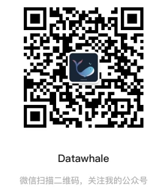

# Dive-into-CV-PyTorch

本项目《动手学CV-Pytorch版》是Datawhale:whale:CV小组近期开始推动的一个重点项目。

受启发于李沐老师的[《动手学深度学习》](https://zh.d2l.ai/)，我们旨在构建一个以Pytorch为框架，强调动手实战的计算机视觉教程项目，帮助大家更好的学习。

项目大体上会分为3个阶段，循序渐进：

- 入门篇

    主要面向刚入门的学习者，带你走进CV的世界。

- 中级篇

    以动手实战的方式为主，通过案例带你对CV的各个细分领域有所了解。

- 高级篇

    主要以paper笔记或教程的形式分享最新的研究，学无止境。
    
“for the learner，和学习者一起成长”是我们的愿景。

目前项目还处于初期：入门篇的开发阶段。如果热爱学习且认同Datawahle开源精神的你正好路过，不妨先点个:star:收藏一下吧，相信随着项目的推进，你我将互相见证彼此的进步。

## 食用方法

没什么特别的，每一小节都配备了markdown教程，涉及实战的部分会有相应的代码。学就完事了～

为避免各位遇到GitHub的网络问题，教程中使用的图片均已上传到项目的`markdown_imgs`目录下，并在md文件中使用类似``的相对路径进行引用

常见问题：

[github无法加载图片的解决办法](https://blog.csdn.net/u011583927/article/details/104384169)

公式无法正常显示接近办法：部分理论较多的章节不可避免的会涉及公式，为了让公式正常显示，强烈建议安装chrome的`MathJax Plugin for Github`插件。

以下是目录与代码更新进度

## 动手学CV-Pytorch 入门篇

* 1\. 预备知识
    - [x] 1.1 深度学习环境配置
    - [x] 1.2 Pytorch基础使用介绍
    - [x] 1.3 自动求梯度
    - [x] 1.4 线性回归-小试身手
* 2\. 图片分类入门
    - [x] 2.1 数据读取与数据扩增
    - [x] 2.2 图像分类介绍
        - [x] 卷积神经网络基础
        - [x] 经典图像分类模型简介
            - [x] LeNet
            - [x] AlexNet
            - [x] VGG
            - [x] 网络中的网络（NiN）
            - [x] 含并行连结的网络（GoogLeNet）
            - [x] 批量归一化（Batch Normalization）
            - [x] 残差网络（ResNet）
    - [x] 2.3 模型训练与验证
    - [x] 2.4 模型集成
    - [x] 2.5 天池计算机视觉入门赛: SVHN数据集实战

持续更新中......

## 致谢

<table align="center" style="width:80%;">
  <caption><b>贡献者名单</b></caption>
<thead>
  <tr>
    <th>成员</th>
    <th>介绍</th>
    <th>个人主页</th>
  </tr>
</thead>
<tbody>
  <tr>
    <td>安晟</td>
    <td>一只普通的算法攻城狮 </td>
    <td><a href="https://blog.csdn.net/u011583927">CSDN博客</a>,   <a href="https://github.com/monkeyDemon">Github</a></td>
  </tr>
  <tr>
    <td>张强</td>
    <td>宁波大学计算机硕士</td>
    <td><a href="https://github.com/QiangZiBro">Github</a></td>
  </tr>
  <tr>
    <td>王程伟</td>
    <td>南昌航空大学研究生   </td>
    <td><a href="https://blog.csdn.net/weixin_40647819">CSDN博客</a></td>
  </tr>
  <tr>
    <td>伊雪</td>
    <td>中电科网安研究院开发工程师</td>
    <td> </td>
  </tr>
  <tr>
    <td>樊亮</td>
    <td>Datawhale成员</td>
    <td><a href="https://blog.csdn.net/OuDiShenmiss">CSDN博客</a></td>
    <td> </td>
  </tr>
  <tr>
    <td>杨皓博</td>
    <td>Datawhale成员</td>
    <td><a href="https://github.com/Dulpyanghaobo">Github</a></td>
    <td> </td>
  </tr>
  <tr>
    <td>阿水</td>
    <td>公众号：Coggle数据科学 </td>
    <td><a href="https://www.zhihu.com/people/finlayliu">知乎</a></td>
  </tr>
</tbody>
</table> 

## 关注我们

> "Datawhale，一个专注于AI领域的学习圈子。初衷是for the learner，和学习者一起成长。目前加入学习社群的人数已经数千人，组织了机器学习，深度学习，数据分析，数据挖掘，爬虫，编程，统计学，Mysql，数据竞赛等多个领域的内容学习，微信搜索公众号Datawhale可以加入我们。"

