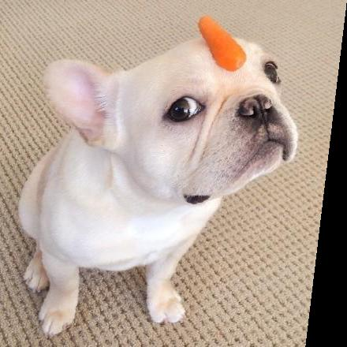
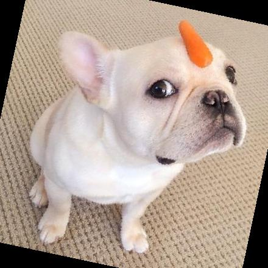
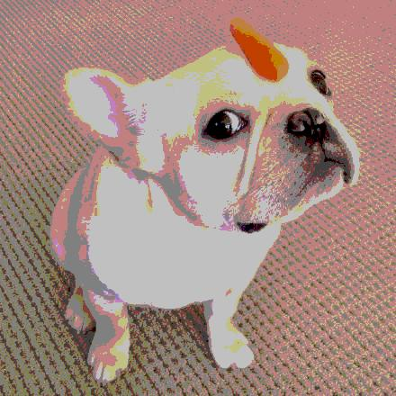
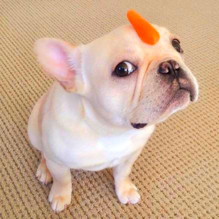
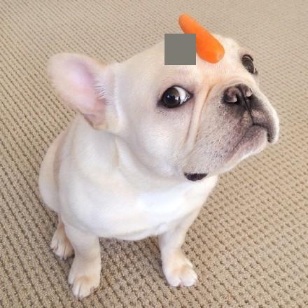
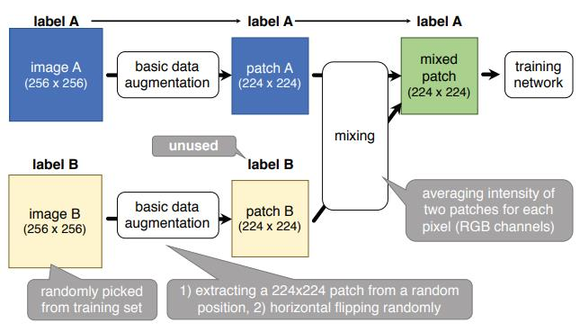

## 现有数据增强方法总结

### ShearX, ShearY

### TranslateX, TranslateY

### Rotate

### AutoContrast

调整图像对比度。计算一个输入图像的直方图，从这个直方图中去除最亮和最暗的部分，然后重新映射图像，以便保留的最暗像素变为黑色，即0，最亮的变为白色，即255。

### Invert

将输入图像转换为反色图像。

### Equalize

直方图均衡化，产生像素值均匀分布的图像

### Solarize

反转在阈值threshold范围内的像素点（>threshold的像素点取反)

例如一个像素的取值为124=01111100

如果threshold=100，返回的结果为131=10000011

如果threshold=200，返回结果为124 (124<200)

### Posterize

色调分离，将每个颜色通道上像素值对应变量的最低的(8-x)个比特位置0，x的取值范围为[0，8]

### Contrast

调整图片的对比度

ImageEnhance.Contrast(img).enhance(v)

v = 1 保持原始图像, v < 1 像素值间差距变小， v > 1 增强对比度，像素值间差异变大

### Color

调整图片的饱和度

ImageEnhance.Color(img).enhance(v)

v = 1 保持原始图像, v < 1 饱和度减小趋于灰度图， v > 1 饱和度增大色情更饱满

### Brightness

调整图片的亮度

ImageEnhance.Brightness(img).enhance(v)

v = 1 保持原始图像, v < 1 亮度减小， v > 1 亮度增大

### Sharpness

调整图片锐度

ImageEnhance.Sharpness(img).enhance(v)

v = 1 保持原始图像, v < 1 产生模糊图片， v > 1 产生锐化后的图片

### Cutout

[Improved Regularization of Convolutional Neural Networks with Cutout
](https://arxiv.org/pdf/1708.04552.pdf)

对训练图像进行随机遮挡，该方法激励神经网络在决策时能够更多考虑次要特征，而不是主要依赖于很少的主要特征

Cutout是一种类似于DropOut的正则化方法，被证明对于模型涨点非常有效。

### Random erasing

Random erasing其实和cutout非常类似，也是一种模拟物体遮挡情况的数据增强方法。区别在于，cutout每次裁剪掉的区域大小是固定的，Random erasing替换掉的区域大小是随机的, 使用随机数替换。

### Sample Pairing

[Data Augmentation by Pairing Samples for Images Classification](https://arxiv.org/pdf/1801.02929.pdf)

### Mixup

[mixup: BEYOND EMPIRICAL RISK MINIMIZATION](https://arxiv.org/pdf/1710.09412.pdf)

原理可以简单概括为随机抽取两个样本进行简单的随机加权求和，同时样本的标签也对应加权求和

[Bag of Freebies for Training Object Detection Neural Networks](https://arxiv.org/pdf/1902.04103.pdf)中将mixup应用在目标检测算法上，同样效果也很好。

### CutMix

[Cutmix: Regularization strategy to train strong classifiers with localizable features](https://arxiv.org/pdf/1905.04899v1.pdf)

### Ricap

[Data Augmentation using Random Image Cropping and Patching for Deep CNNs](https://arxiv.org/pdf/1811.09030.pdf)

