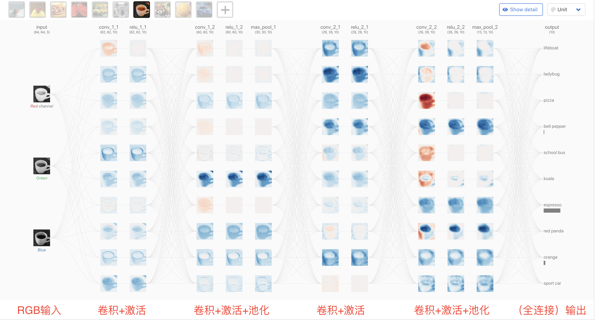

# Task03 经典图像分类模型介绍

## 介绍

​		本文我们来回顾经典的卷积神经网络（Convolution Nerual Network，简称CNN ）。CNN是一类特殊的人工神经网络，是深度学习中重要的一个分支。CNN在很多领域都表现优异，精度和速度比传统计算学习算法高很多。特别是在计算机视觉领域，CNN是解决图像分类、图像检索、物体检测和语义分割的主流模型。

​		学习本章节内容前，希望读者已经了解多层感知机，以及反向传播算法等原理。这里我们希望进行更多直觉上与工程上的讲解，因此不会涉及太多理论公式。首先回顾多层感知机（MLP），如下左图[^1]的例子，这个网络可以完成简单的分类功能。怎么实现呢？每个实例从输入层（input layer）输入，因为输入维度为3，所以要求输入实例有三个维度。接下来，通过隐藏层（hidden layer）进行**升维**，网络层与层之间采用全连接（fully connected）的方式，每一层输出都要通过**激活函数**进行非线性变换，前向计算得到输出结果（output layer）。训练采用有监督的学习方式进行梯度反向传播（BP）。

<center>
  <div>
  
  
  </div>
  <div>
    左：具有4层的感知机，右：卷积神经网络
  </div>
</center>

​		MLP能够对简单的，维度较低的数据进行分类。而对于维度较高的图片，便凸显问题。例如，cifar10数据集每张图都是$32 \times 32$的图片，如果我们用一个MLP网络进行图像分类，其输入是$32 \times 32 \times 3 = 3072$维，假设这是一个十分类的MLP网络，其架构是`3072 --> 4096 --> 4096--> 1`0 ,网络的参数为
$$
3072 \times 4096 + 4096 \times 4096 + 4096 \times 10 = 29401088 \approx 三千万
$$
​		小小一张图片需要耗费巨大参数，如果将图片换成现在人们常用的图片，参数量更是惊人的！于是，CNN很好地解决了这个问题，网络的每层都只有三个维度：宽，高，深度。这里的深度指图像通道数，每个通道都是图片，代表我们要分析的一个属性。比如，灰度图通道数是1，RGB图像通道数是3，CMYK[^2]图像通道数是4，而卷积网络层的通道数会更高。


## 卷积神经网络基础

​		下面我们对CNN中的关键知识做介绍。在学习卷积神经网络时，笔者建议先直观理解思想，再研究原理。现在有许多CNN计算可视化工具，我们可以借助这些工具来学习CNN。这里我们使用最近新出的[CNN explainer](https://poloclub.github.io/cnn-explainer/)[^2] 来学习这些思想，CNN explainer使用了一个[tiny-VGG](https://github.com/poloclub/cnn-explainer/tree/master/tiny-vgg)，在浏览器里，我们可以看到CNN计算的细节。


<center>
  <div>
    
  </div>
  <div>
  	CNN explainer
  </div>
</center>

### 输入层
​		输入层（最左边的层）代表输入到CNN中的图像。 因为RGB图像作为输入，所以输入层具有三个通道，分别对应于该层中显示的红色，绿色和蓝色通道。

### 二维卷积层

#### 卷积（convolution）

​		二维卷积层的参数由一组可学习的**卷积核**（filter）组成。 每个卷积核尺度都很小（沿宽度和高度方向），但是深度会延伸到输入**感受野**（receptive field 又译接收域）的所有通道，也就是说，卷积核和感受野的尺寸大小是一样的，尺寸对应的。

​		卷积核和感受野之间的卷积操作如下图。感受野与卷积核大小一致，对应位置相乘再相加，即可得到结果。可见：单个卷积核与图片的一个感受野进行卷积，结果是下一层图片对应位置的一个像素点，一张输入图片与一个卷积核的输出结果是一张图片。

<div align="center">
	
	<div> 卷积操作</div>
</div>
​		**多输入通道** 卷积核窗口形状为$k_h\times k_w$。当$c_i=1$时，我们知道卷积核只包含一个形状为$k_h\times k_w$的二维数组。当$c_i > 1$时，我们将会为每个输入通道各分配一个形状为$k_h\times k_w$的核数组。把这$c_i$个数组在输入通道维上连结，即得到一个形状为$c_i\times k_h\times k_w$的卷积核。如下图，点开第一个卷积层，可以看到一组通道数为3的卷积核，与输入的通道为3的图像进行卷积，得到3个中间结果（表示在intermidiate层），再将三个中间结果对象像素位置相加，加上可学习的bias，得到一个通道的卷积结果。

​		**多输出通道** 当输入通道有多个时，因为我们对各个通道的结果做了累加，所以不论输入通道数是多少，输出通道数总是为1。设卷积核输入通道数和输出通道数分别为$c_i$和$c_o$，高和宽分别为$k_h$和$k_w$。如果希望得到含多个通道的输出，我们可以为每个输出通道分别创建形状为$c_i\times k_h\times k_w$的核数组。将它们在输出通道维上连结，卷积核的形状即$c_o\times c_i\times k_h\times k_w$。如果我们希望得到多个通道的输出，输入层有3个神经元，而后继的conv_1层有10个神经元，因此，我们需要10组卷积核，一共是$10 \times 3 = 30$个卷积核。

**总结**

- 多输入通道需要一**组**卷积核进行卷积操作，得到一个通道输出
- 多输出通道需要多**组**卷积核进行卷积操作，得到多个通道输出


<div align="center">
  
  <div>
    卷积层
  </div>
</div>
​		每个卷积核有9个参数，计算一个卷积层参数大小则为：
$$
(3 \times 3 )\times 30 + 10 = 280
$$
​		相比于全连接，参数数量大大减小。


#### 填充（padding）

​		填充可以在激活图的边界处保存数据，从而提高性能，并且可以帮助保留输入的空间大小，从而使体系结构设计人员可以构建性能更高，更流畅的网络。 存在许多填充技术，但是最常用的方法是零填充，因为它的性能，简单性和计算效率高。 该技术涉及在输入的边缘周围对称地添加零。 许多高性能的CNN（例如AlexNet）都采用了这种方法。

#### 步长（itride）

​		步幅表示卷积核一次应移动多少像素。如上面的卷积层例子，Tiny VGG的卷积层使用步幅为1，这意味着在输入的3x3窗口上执行点积以产生输出值，然后将其移至 每进行一次后续操作，就增加一个像素。 跨度对CNN的影响类似于内核大小。 随着步幅的减小，由于提取了更多的数据，因此可以了解更多的功能，但输出层也更大。 相反，随着步幅的增加，这将导致特征提取更加受限，输出层尺寸更小。 网络设计人员的职责之一是在实现CNN时确保内核对称地跨输入滑动。 

### 激活函数

#### Relu

​		CNN包含大量的图层，这些图层能够学习到越来越多的功能。为什么CNN能取得如此大的准确性，其原因在于它们的非线性。非线性是产生非线性决策边界所必需的，因此输出不能写为输入的线性组合。如果没有非线性激活函数，那么CNN架构将演变为一个等效的卷积层，其性能就不会变得那么好。经验上表明，ReLU相比其他激活函数，比如Sigmoid函数，前者性能会更好。Relu计算方法很简单：
$$
\text{ReLU}(x) = \max(0,x)
$$

<div align="center">
  
  <div>
    卷积层
  </div>
</div>

#### Softmax

softmax操作的主要目的是：确保CNN输出的总和为1。因此，softmax操作可用于将模型输出缩放为概率。
$$
\text{Softmax}(x_{i}) = \frac{\exp(x_i)}{\sum_j \exp(x_j)}
$$


<div align="center">
  
  <div>
    Softmax
  </div>
</div>

### 池化层

​		在不同的CNN架构中，池化层的类型很多，但是它们的目的都是要逐渐**减小网络的空间范围**，从而减少网络的参数和总体计算。 上面的Tiny VGG架构中使用的池类型为最大池化(Max-Pooling)。

​		最大池化操作需要在设计网络过程中选择过滤核的大小和步长。 一旦选定，该操作将以指定的步长在输入上滑动过滤核，同时仅从输入中选择每个内核切片上的最大值以产生输出值。 在上面的Tiny VGG体系结构中，池化层使用2x2过滤核，步长为2。使用这些规范进行此操作，将导致75％的激活被丢弃。 通过丢弃如此多的值，Tiny VGG的计算效率更高，并且避免了**过拟合**。

## 经典图像分类模型介绍

#### LeNet

 <center></center>   

##### 网络架构

LeNet分为卷积层块和全连接层块两个部分。下面我们分别介绍这两个模块。

卷积层块里的基本单位是卷积层后接最大池化层：卷积层用来识别图像里的空间模式，如**线条**和**物体局部**，之后的最大池化层则用来降低卷积层对位置的敏感性。卷积层块由两个这样的基本单位重复堆叠构成。在卷积层块中，每个卷积层都使用5×5的窗口，并在输出上使用sigmoid激活函数。第一个卷积层输出通道数为6，第二个卷积层输出通道数则增加到16。这是因为第二个卷积层比第一个卷积层的输入的高和宽要小，所以增加输出通道使两个卷积层的参数尺寸类似。卷积层块的两个最大池化层的窗口形状均为2×2，且步幅为2。由于池化窗口与步幅形状相同，池化窗口在输入上每次滑动所覆盖的区域互不重叠。

卷积层块的输出形状为(批量大小, 通道, 高, 宽)。当卷积层块的输出传入全连接层块时，全连接层块会将小批量中每个样本变平（flatten）。也就是说，全连接层的输入形状将变成二维，其中第一维是小批量中的样本，第二维是每个样本变平后的向量表示，且向量长度为通道、高和宽的乘积。全连接层块含3个全连接层。它们的输出个数分别是120、84和10，其中10为输出的类别个数。  

##### 代码实战

[完整代码](2.2.2_classical_cnn_models/lenet/LeNet.py)

网络定义:

```python
#Lenet network
class Net(nn.Module):
    def __init__(self):
        super().__init__()
        self.conv1 = nn.Conv2d(3, 6, 5) #in_channels, out_channels, kernel_size, stride=1 ...
        self.conv2 = nn.Conv2d(6, 16, 5)
        self.fc1 = nn.Linear(16 * 5 * 5, 120)
        self.fc2 = nn.Linear(120, 84)
        self.fc3 = nn.Linear(84, num_classes)

    def forward(self, x):
        x = F.max_pool2d(F.relu(self.conv1(x)), kernel_size=(2, 2))
        x = F.max_pool2d(F.relu(self.conv2(x)), kernel_size=(2, 2))

        x = x.view(x.size()[0], -1)
        x = F.relu(self.fc1(x))
        x = F.relu(self.fc2(x))
        x = self.fc3(x)
        return x
```


​    

##### 总结

通过多次卷积和池化，CNN的最后一层**将输入的图像像素映射为具体的输出**。如在分类任务中会转换为不同类别的概率输出，然后计算真实标签与CNN模型的预测结果的差异，并通过反向传播更新每层的参数，并在更新完成后再次前向传播，如此反复直到训练完成 。与传统机器学习模型相比，CNN具有一种端到端（End to End）的思路。在CNN训练的过程中是直接从图像像素到最终的输出，并不涉及到具体的特征提取和构建模型的过程，也不需要人工的参与。

#### AlexNet

 <center></center>  

##### 网络架构

- 上下两个部分结构一样，为了方便在两块GPU上进行训练
- 每个部分有五个卷积层，三个全连接层

【注】由于上下两部分完全一致，分析时一般取一部分即可。


##### 代码实战

[完整代码](2.2.2_classical_cnn_models/lenet/AlexNet.py)

模型定义

```python
class AlexNet(nn.Module):
    def __init__(self, num_classes=NUM_CLASSES):
        super(AlexNet, self).__init__()
        self.features = nn.Sequential(
            nn.Conv2d(3, 64, kernel_size=3, stride=2, padding=1),
            nn.ReLU(inplace=True),
            nn.MaxPool2d(kernel_size=2),
            nn.Conv2d(64, 192, kernel_size=3, padding=1),
            nn.ReLU(inplace=True),
            nn.MaxPool2d(kernel_size=2),
            nn.Conv2d(192, 384, kernel_size=3, padding=1),
            nn.ReLU(inplace=True),
            nn.Conv2d(384, 256, kernel_size=3, padding=1),
            nn.ReLU(inplace=True),
            nn.Conv2d(256, 256, kernel_size=3, padding=1),
            nn.ReLU(inplace=True),
            nn.MaxPool2d(kernel_size=2),
        )
        self.classifier = nn.Sequential(
            nn.Dropout(),
            nn.Linear(256 * 2 * 2, 4096),
            nn.ReLU(inplace=True),
            nn.Dropout(),
            nn.Linear(4096, 4096),
            nn.ReLU(inplace=True),
            nn.Linear(4096, num_classes),
        )

    def forward(self, x):
        x = self.features(x)
        x = x.view(x.size(0), 256 * 2 * 2)
        x = self.classifier(x)
        return x
```


##### 实验结果

​		在2010年的 ImageNet LSVRC-2010上，AlexNet 在给包含有1000种类别的共120万张高分辨率图片的分类任务中，在测试集上的top-1和top-5错误率为37.5%和17.0%（**top-5 错误率：即对一张图像预测5个类别，只要有一个和人工标注类别相同就算对，否则算错。同理top-1对一张图像只预测1个类别**），在 ImageNet LSVRC-2012 的比赛中，取得了top-5错误率为15.3%的成绩。AlexNet 有6亿个参数和650,000个神经元，包含5个卷积层，有些层后面跟了max-pooling层，3个全连接层，为了减少过拟合，在全连接层使用了dropout，下面进行更加详细的介绍。

​		数据来源于**[ImageNet](http://www.image-net.org/)**，训练集包含120万张图片，验证集包含5万张图片，测试集包含15万张图片，这些图片分为了1000个类别，并且有多种不同的分辨率，但是AlexNet的输入要求是固定的分辨率，为了解决这个问题，Alex的团队采用低采样率把每张图片的分辨率降为256×256，具体方法就是给定一张矩形图像，首先重新缩放图像，使得较短边的长度为256，然后从结果图像的中心裁剪出256×256大小的图片。

​		

##### 总结

- 使用relu。在此之前都用饱和的非线性激活函数$tanh(x)=(1+e^{-x})^{-1}$，但其比非饱和非线性函数$relu(x)=max(0,x)$函数，梯度下降慢，因此用了`relu`函数，结果如下图

 <center><div>
   
   </div>
	<div>
    实线使用了relu，虚线使用了tanh
   </div>
</center>  


- 多GPU训练。
- 用Dropout来控制全连接层的模型复杂度。
- 引入数据增强，如翻转、裁剪和颜色变化，从而进一步扩大数据集来缓解过拟合。


#### VGG

[VGG](https://link.zhihu.com/?target=https%3A//arxiv.org/abs/1409.1556)是Oxford的**V**isual **G**eometry **G**roup的组提出的。该网络是在ILSVRC 2014上的相关工作，主要工作是证明了增加网络的深度能够在一定程度上影响网络最终的性能。VGG有两种结构，分别是VGG16和VGG19，两者并没有本质上的区别，只是网络深度不一样。[^3]

##### 网络架构

<center>
   <div>
     
   </div>
   <div>
     VGG16
   </div>
</center>  

##### 代码实战

[简单vgg案例](2.2.2_classical_cnn_models/VGG/)

[VGG各模型综合比较](2.2.2_classical_cnn_models/pytorch-vgg-cifar10/)

##### 总结

- 使用了3个3x3卷积核来代替7x7卷积核，使用了2个3x3卷积核来代替5*5卷积核。这样做的主要目的是在保证具有相同感知野的条件下，提升了网络的深度（因为多层非线性层可以增加网络深度来保证学习更复杂的模式），在一定程度上提升了神经网络的效果。

> 设输入通道数和输出通道数都为C， 3个步长为1的3x3卷积核的一层层叠加作用可看成一个大小为7的感受野（其实就表示3个3x3连续卷积相当于一个7x7卷积），其参数总量为$ 3\times (9\times C^2)$ ，如果直接使用7x7卷积核，其参数总量为 $49\times C^2$ 。很明显，$27\times C^2 $ 小于$49\times C^2$，即减少了参数；而且3x3卷积核有利于更好地保持图像性质。

- VGGNet的结构非常简洁，整个网络都使用了同样大小的卷积核尺寸（3x3）和最大池化尺寸（2x2）。
- 几个小滤波器（3x3）卷积层的组合比一个大滤波器（5x5或7x7）卷积层好：
- 验证了通过不断加深网络结构可以提升性能。

- 缺点是VGG耗费更多计算资源，并且使用了更多的参数，这里不是3x3卷积的原因，其中绝大多数的参数都是来自于第一个全连接层。

#### 网络中的网络（NiN）

​		前⼏节介绍的LeNet、AlexNet和VGG在设计上的共同之处是:先以由卷积层构成的模块充分抽取空间特征，再以由全连接层构成的模块来输出分类结果（下左图）。其中，AlexNet和VGG对LeNet的改进主要在于如何对这两个模块加宽(增加通道数)和加深。

​		本节我们介绍网络中的⽹络(NiN)。它提出了另外⼀个思路，即串联多个由卷积层和“全连接”层构成的⼩网络，又称MLP卷积，来构建⼀个深层网络（下右图）。使用这种结构的原因有两个，一， MLP与CNN更兼容，并使用反向传播进行训练；二，MLP本身可以是深度模型，这与特性重用的精神是一致的。

​		

<div align="center">
  
  
</div>

​		

##### 网络架构

​		前3层是MLP卷积层，最后一层是全局平均池化。

<center>
   <div>
     
   </div>
   <div>
     NiN网络架构
   </div>
</center>  


#### 含并行连结的网络（GoogLeNet）


#### 批量归一化（Batch Normalization）


#### 残差网络（ResNet）


## 参考文献


[^1]:https://cs231n.github.io/convolutional-networks/#overview
[^2]:https://poloclub.github.io/cnn-explainer/
[^3]: https://zhuanlan.zhihu.com/p/41423739 ,Amusi, 《一文读懂VGG网络》


**Task03 CNN基础**

--- ***By: QiangZiBro***


>https://github.com/QiangZiBro


**关于Datawhale**：

>Datawhale是一个专注于数据科学与AI领域的开源组织，汇集了众多领域院校和知名企业的优秀学习者，聚合了一群有开源精神和探索精神的团队成员。Datawhale以“for the learner，和学习者一起成长”为愿景，鼓励真实地展现自我、开放包容、互信互助、敢于试错和勇于担当。同时Datawhale 用开源的理念去探索开源内容、开源学习和开源方案，赋能人才培养，助力人才成长，建立起人与人，人与知识，人与企业和人与未来的联结。


